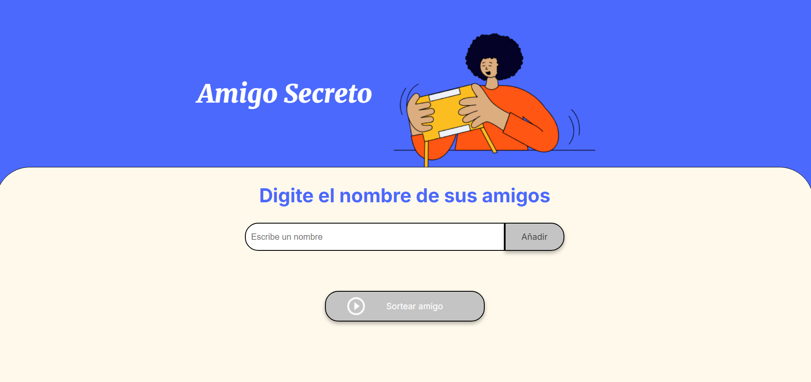
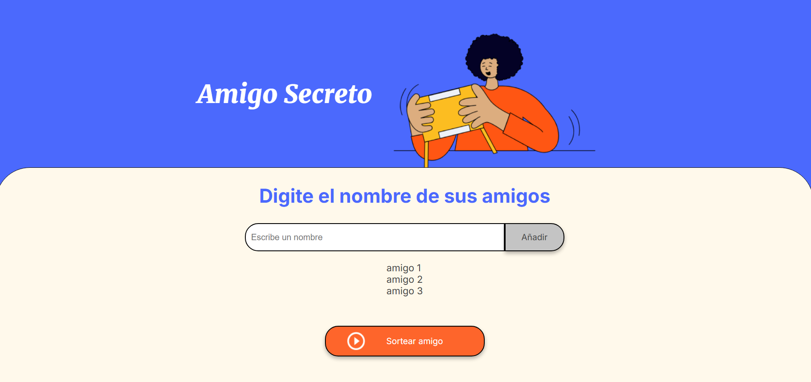
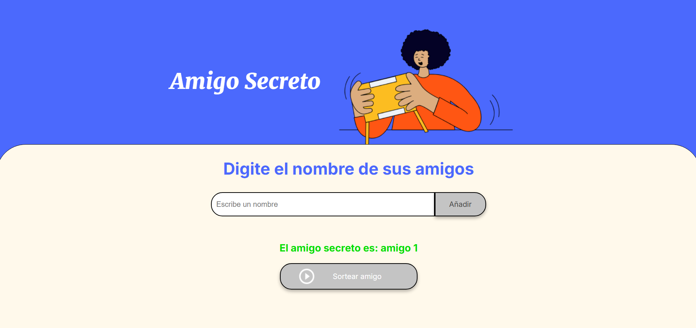

# Amigo Secreto

Este proyecto es una aplicación web interactiva que permite gestionar un sorteo de amigo secreto de manera sencilla y divertida , que forma parte de un Desafio de Alura Latam.

## ✅ Características

- **Agregar amigos:** Los usuarios pueden ingresar los nombres de sus amigos que participarán en el sorteo.
- **Validación de entrada:** No se permiten entradas vacías; se mostrará un mensaje de alerta si no se ingresa un nombre.
- **Deshabilitar botón de sorteo:** El botón de sorteo está deshabilitado hasta que se agreguen al menos dos nombres a la lista.
- **Sortear amigo secreto:** Al hacer clic en el botón de sorteo, se selecciona aleatoriamente uno de los nombres de la lista.
- **Reinicio automático:** Después de realizar el sorteo, la lista de nombres se vacía automáticamente para que pueda reiniciarse el proceso.
- **Diseño responsivo:** La aplicación se adapta a dispositivos móviles y pantallas pequeñas mediante el uso de media queries.

## 👨‍💻 Tecnologías Utilizadas

- **HTML:** Estructura de la página.
- **CSS:** Estilos visuales, incluyendo diseño responsivo para móviles.
- **JavaScript:** Lógica interactiva para agregar nombres, realizar el sorteo y gestionar el estado del botón.

## 📂 Archivos Principales

1. `index.html`: Contiene la estructura de la página.
2. `style.css`: Define los estilos de la interfaz, incluyendo los estilos responsivos.
3. `app.js`: Contiene la lógica para agregar amigos, deshabilitar el botón de sorteo y seleccionar un amigo secreto.

## 📝 Instrucciones de Uso

1. **Agregar un nombre:** Escribe el nombre de un amigo en el campo de entrada y haz clic en "Añadir".
2. **Revisar la lista:** Los nombres añadidos aparecerán en la lista debajo del campo de entrada.
3. **Habilitar el botón de sorteo:** Una vez que haya al menos dos nombres en la lista, el botón "Sortear amigo" se habilitará.
4. **Realizar el sorteo:** Haz clic en "Sortear amigo" para seleccionar un nombre aleatoriamente. El nombre del amigo secreto aparecerá en pantalla, y la lista se vaciará automáticamente.

## 📸 Capturas de Pantalla

## 📱 Estilo Responsivo

La aplicación está optimizada para dispositivos móviles. Al usar una pantalla de menos de 500px de ancho:

- El encabezado cambia su dirección a columna.
- Los textos y elementos visuales se redimensionan para mejorar la experiencia del usuario.

## 🎨 Personalización

Puedes modificar los colores, fuentes y estilos generales editando el archivo `style.css`. Además, se pueden agregar nuevas funcionalidades actualizando el archivo `app.js`.

## 🚀 Ideas para Mejoras Futuras

- Permitir guardar y recuperar la lista de amigos utilizando almacenamiento local.
- Agregar opciones para enviar los resultados por correo electrónico o mensaje.
- Mejorar las animaciones y transiciones.

## 📜 Licencia

Este proyecto se proporciona "tal cual". Eres libre de utilizarlo, modificarlo y compartirlo para propósitos personales o educativos.

## 📞 Contacto

Puedes contactar conmigo en Discord: **@.leandro_vc**

## 🌟 ¡Gracias por visitar mi proyecto!

